<!-- DevXOmar / profile README Visual system: Midnight Navy × Electric Cyan × Indigo North star: polished research/engineering profile with restrained motion. -->

  

     

 <strong>I build intelligent systems that need to work beyond the demo.</strong>  AI/ML research · LLM reliability · cyber-intelligence · backend systems · autonomous systems 

  

  

 

<table align="center"> <tr> <td align="center" width="25%"> <h3>SIH ’25</h3> <strong>Winner</strong> TattvaDrishti </td> <td align="center" width="25%"> <h3>AICTE</h3> <strong>Research Intern</strong> Cybersecurity </td> <td align="center" width="25%"> <h3>LLM Lens</h3> <strong>Research Intern</strong> Model reliability </td> <td align="center" width="25%"> <h3>Rakshak</h3> <strong>Published application</strong> Co-inventor </td> </tr> </table>

01 / Current signal

<table> <tr> <td width="50%" valign="top"> <h3>🛡️ Cybersecurity Research · AICTE</h3> 
Advancing an SIH-derived cybersecurity system through research, validation, testing, and enterprise-focused refinement.
 </td> <td width="50%" valign="top"> <h3>🧠 LLM Research · LLM Lens Paradigm</h3> 
Studying LLM internal states and model behavior through probing, evaluation, uncertainty analysis, and experiments around model reliability.
 </td> </tr> <tr> <td width="50%" valign="top"> <h3>⚙️ TATTVASTRA / JOCKY</h3> 
Current systems + cybersecurity build, with a public product surface for the JOCKY project.
 
<a href="https://github.com/DevXOmar/Tattvastra-website"><strong>Open product repository ↗</strong></a>
 </td> <td width="50%" valign="top"> <h3>🌐 PR KMIT</h3> 
Building and maintaining the digital layer behind PR KMIT, including the official website and event-focused web systems.
 </td> </tr> </table>

  

02 / Selected systems

<table> <tr> <td width="50%" valign="top"> <h3>🛰️ TattvaDrishti</h3> 
<strong>Smart India Hackathon 2025 Winner</strong>
 
An analyst-facing intelligence platform for detecting AI-generated and coordinated malign information operations, with multi-layer risk scoring, graph intelligence, provenance, and secure sharing.
 
<code>FastAPI</code> <code>Next.js</code> <code>DeBERTa-v3</code> <code>Transformers</code> <code>NetworkX</code>
 
<a href="https://github.com/Team-ASHTOJ/TattvaDrishti"><strong>View repository ↗</strong></a>
 </td> <td width="50%" valign="top"> <h3>📈 Paytm Grow</h3> 
<strong>Merchant-growth intelligence prototype</strong>
 
A Paytm-style merchant intelligence layer combining loyalty and CLV modeling, forecasting, peer-price benchmarking, adaptive rewards, and explainable loan-readiness coaching.
 
<code>FastAPI</code> <code>React</code> <code>TypeScript</code> <code>BG/NBD</code> <code>Holt-Winters</code> <code>SHAP</code>
 
<a href="https://github.com/DevXOmar/PaytmGrow"><strong>View repository ↗</strong></a>
 </td> </tr> <tr> <td width="50%" valign="top"> <h3>🛡️ Rakshak</h3> 
<strong>Prakalp ’25 Winner · Patent application published</strong>
 
An autonomous surveillance rover combining GPS waypoint navigation, LiDAR obstacle avoidance, computer vision, telemetry, and human takeover for security and patrolling workflows.
 
<code>Jetson Nano</code> <code>Pixhawk</code> <code>LiDAR</code> <code>OpenCV</code> <code>ArduPilot</code>
 
<a href="https://github.com/DevXOmar/rakshak-files"><strong>View project files ↗</strong></a>
 </td> <td width="50%" valign="top"> <h3>💳 Nyord</h3> 
<strong>Full-stack banking system</strong>
 
A backend-heavy banking platform with customer/admin workflows across accounts, transfers, loans, cards, QR payments, background processing, and real-time notifications.
 
<code>FastAPI</code> <code>PostgreSQL</code> <code>RabbitMQ</code> <code>Celery</code> <code>WebSockets</code>
 
<a href="https://github.com/DevXOmar/Nyord"><strong>View repository ↗</strong></a>
 </td> </tr> </table>

 <a href="https://github.com/DevXOmar?tab=repositories"><strong>Explore all repositories →</strong></a> 

03 / Working set

  

<table> <tr> <td width="23%"><strong>Research & AI</strong></td> <td>PyTorch · Transformers · Hugging Face · LLM probing · RAG · LangChain · LangGraph · agentic systems</td> </tr> <tr> <td><strong>Backend & Systems</strong></td> <td>FastAPI · PostgreSQL · RabbitMQ · Celery · WebSockets · SSE · REST APIs · event-driven workflows</td> </tr> <tr> <td><strong>Product</strong></td> <td>Next.js · React · TypeScript · Tailwind · PWA · real-time dashboards</td> </tr> <tr> <td><strong>Infra & Edge</strong></td> <td>Docker · GitHub Actions · Azure · Linux · Jetson Nano · Pixhawk · LiDAR · OpenCV</td> </tr> </table>

  

04 / Live engineering signal

   

05 / Credentials & range

 
<strong>Certifications</strong>
  

•	IBM RAG and Agentic AI Professional Certificate — RAG, vector databases, multimodal AI, LangChain, LangGraph, CrewAI, AutoGen, BeeAI, MCP, and agent development.
•	ServiceNow Certified System Administrator — platform administration, workflows, CMDB, access control, automation, and analytics.
•	Oracle Cloud Infrastructure 2025 Certified AI Foundations Associate.
•	Oracle Cloud Infrastructure 2025 Certified Foundations Associate.

 
<strong>Beyond code</strong>
  

•	Core Member, Vachan — The Speakers' Club of KMIT, after serving as Club Head and leading a 40+ member community.
•	Developer — PR KMIT, working on the institution's digital presence and event web infrastructure.
•	Former Techfest IIT Bombay Campus Ambassador.
•	GirlScript Summer of Code contributor.
•	Former Technical Lead — VISWAM.AI.
•	Anchor and coordinator across large institutional events.

<!-- LIVE MUSIC SLOT I deliberately keep this hidden until a personal Spotify/Last.fm feed is connected. Once novatorem is deployed for DevXOmar, insert the live card here, e.g.: [[Now Playing](https://YOUR-NOVATOREM-DEPLOYMENT/api/orchestrator?background_type=blur_dark&border_color=22D3EE&show_status=true)](YOUR_SPOTIFY_OR_LASTFM_PROFILE) -->

  

 <strong>Open to research collaborations, engineering internships, ambitious hackathons, and difficult systems worth building.</strong> 

 <a href="mailto:i.am.s.m.omar97@gmail.com">Email</a> · <a href="https://www.linkedin.com/in/shaik-mohammed-omar/">LinkedIn</a> · <a href="https://github.com/DevXOmar?tab=repositories">Repositories</a> 

 BUILDING WITH INTENT · DEVXOMAR / 2026 

